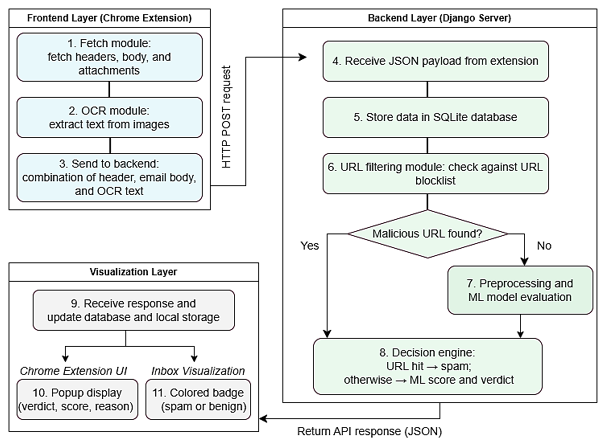
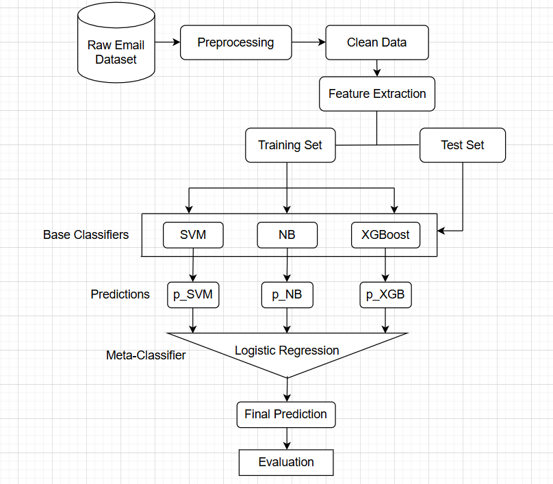
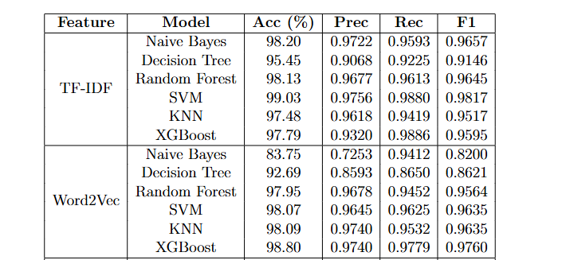
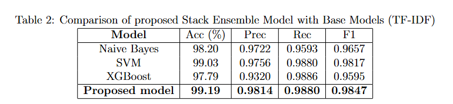
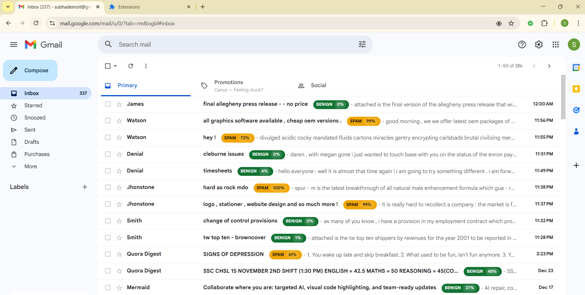

# 📧 Real-Time Spam Email Detection System

## 📌 Project Overview

This project presents a real-time spam email detection system implemented as a Chrome browser extension integrated with a Django backend.  
The system analyzes Gmail messages before user interaction and provides instant spam classification to enhance email security.

---

## 🏗 System Architecture

The framework follows a **three-layer architecture**:

### 🔹 Frontend Layer
- Chrome extension fetches email headers, body, and attachments.

### 🔹 Backend Layer
- Django server processes incoming data  
- Applies URL filtering, OCR, and machine learning classification.

### 🔹 Visualization Layer
- Injects color-coded badges (**Spam / Benign**) directly into the Gmail interface  
- Displays detailed analysis via a popup UI.

---

## 🤖 Stacking Ensemble Learning

The detection model uses a **stacking ensemble approach** combining:

- Support Vector Machine (SVM)  
- Multinomial Naive Bayes  
- XGBoost  

Predictions from base models are fused using **Logistic Regression as a meta-classifier**, improving robustness and overall detection accuracy.

---

## 📊 Results

- Achieved **99.19% accuracy** and **0.9847 F1-score** during offline evaluation  
- Real-time testing showed **sub-second latency** for text-based emails  
- System successfully processed live Gmail emails with stable performance  

---

## 📷 Demo & Screenshots

## 📷 System Architecture

## 🧠 ML Model Workflow

## 📊 Performance Comparison

## ⚡ Latency Analysis

Note: Figures and screenshots are taken from our submitted research paper (currently under review) and developed by the authors.

## 📨 Real-Time Gmail Detection

## 🪟 Popup Interface

